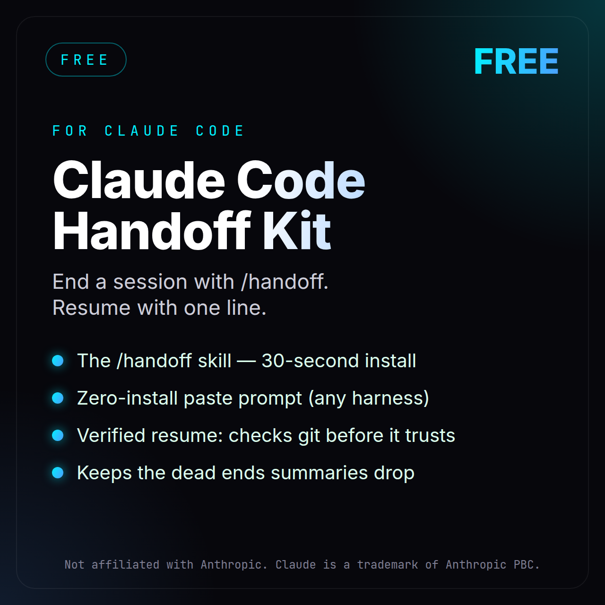
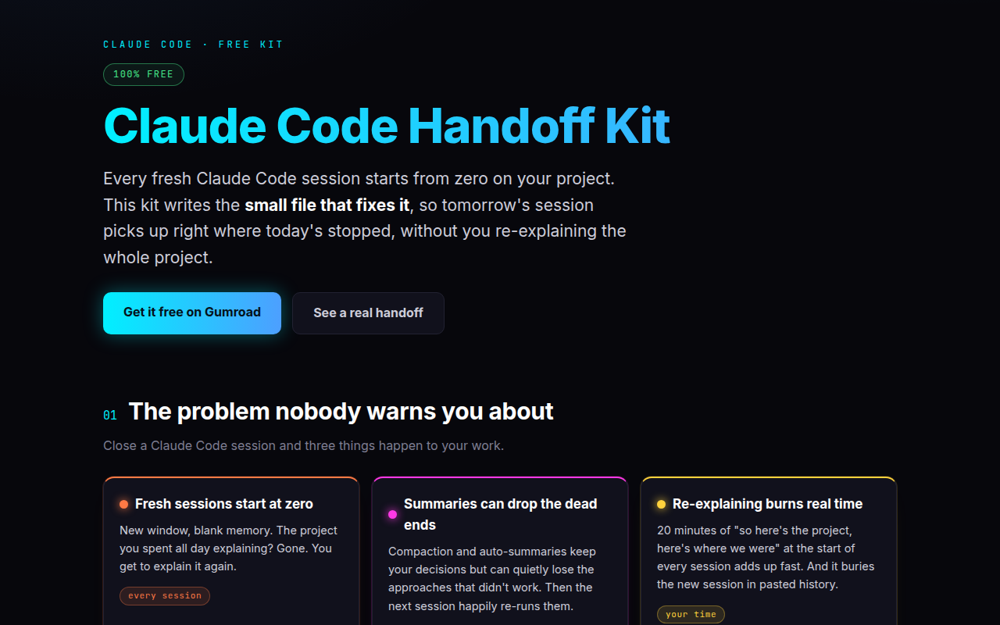
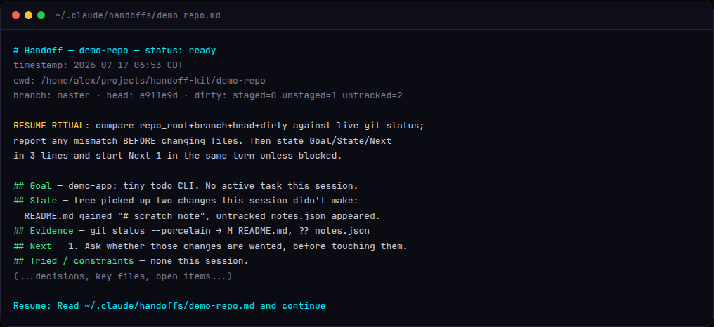
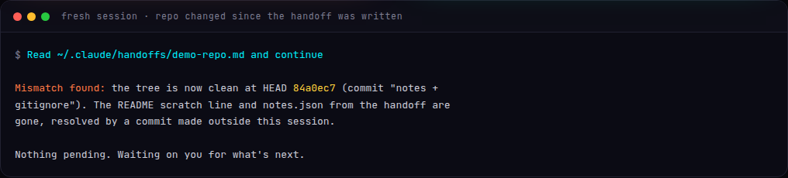

<div align="center">



# Claude Code Handoff Kit

**Close a session today. Resume it tomorrow without re-explaining your project.**

[](kit/LICENSE)
[](kit/CHANGELOG.md)
[](kit/PROMPT.md)
[](https://expressive446.gumroad.com/l/handoff-kit?utm_source=github&utm_medium=readme&utm_campaign=handoff-kit)

[**Download free on Gumroad**](https://expressive446.gumroad.com/l/handoff-kit?utm_source=github&utm_medium=readme&utm_campaign=handoff-kit) · [See a real handoff](kit/docs/EXAMPLE-HANDOFF.md) · [Start here](kit/START-HERE.html)

</div>

---

Every fresh Claude Code session starts your project at zero. Summaries and `/compact`
keep your decisions but quietly drop the most expensive thing you learned: the
approaches that **didn't** work. This kit ends a session with `/handoff`, writes a
lean verified checkpoint, and teaches the next session to **distrust it until it
checks your repo's live state**.



## How it works

**1. End your session with `/handoff`** (or paste the zero-install prompt from
[PROMPT.md](kit/PROMPT.md)). It writes `~/.claude/handoffs/<project>.md` — goal,
exact stop point, verification evidence, next action, and the dead ends — around
30 lines, never a transcript.



**2. Open a fresh session and paste one line:**

```
Read ~/.claude/handoffs/<project>.md and continue
```

**3. The fresh session verifies before it touches anything.** The handoff header
records branch, HEAD, and dirty counts. The resume ritual compares them against
live `git status` and reports drift BEFORE editing a file. This is real output
from our test run — the repo had moved, and the session stopped and said so:



No stale-context edits, no confidently wrong resumes. A mismatch means stop and look.

## Install (60 seconds)

**Skill install** — copy the skill folder, then end any session with `/handoff`:

```bash
cp -r kit/skill/handoff ~/.claude/skills/handoff
```

**No install** — copy the prompt from [kit/PROMPT.md](kit/PROMPT.md) and paste it at
the end of a session. Works in any harness that can write files.

## What's inside

| File | What it is |
|---|---|
| [`kit/START-HERE.html`](kit/START-HERE.html) | Open this first: install, use, resume, uninstall |
| [`kit/PROMPT.md`](kit/PROMPT.md) | Zero-install paste prompt |
| [`kit/skill/handoff/`](kit/skill/handoff/) | Self-contained Claude Code skill (`/handoff`) |
| [`kit/docs/POLICY.md`](kit/docs/POLICY.md) | The rules that make handoffs actually work |
| [`kit/docs/COMPATIBILITY.md`](kit/docs/COMPATIBILITY.md) | What's supported, known limits |
| [`kit/docs/EXAMPLE-HANDOFF.md`](kit/docs/EXAMPLE-HANDOFF.md) | A real generated handoff |

## Privacy

The skill's rules bar secrets, tokens, credentials, private URLs, customer data, and
copied file contents from every handoff. No telemetry, no network calls.

## Get updates

The kit is free — grab it on Gumroad to get fixes and new versions by email:

**[expressive446.gumroad.com/l/handoff-kit](https://expressive446.gumroad.com/l/handoff-kit?utm_source=github&utm_medium=readme&utm_campaign=handoff-kit)**

## More from me

If this kit saves you a re-explain, the paid playbooks go deeper:

| Product | What it does | Price |
|---|---|---|
| [Claude Code Setup Playbook](https://expressive446.gumroad.com/l/biaqgd?utm_source=github&utm_medium=readme&utm_campaign=handoff-kit) | The 3 hooks that stop fake "done", wrong models & wasted tokens | $29 |
| [Agent Memory Kit](https://expressive446.gumroad.com/l/zwkwij?utm_source=github&utm_medium=readme&utm_campaign=handoff-kit) | Give your AI agent a memory that learns who you are | $29 |
| [Claude Code Token Tuner](https://expressive446.gumroad.com/l/abcxjm?utm_source=github&utm_medium=readme&utm_campaign=handoff-kit) | Cut your token bill without losing quality | $19 |
| [AI Scout Pipeline](https://expressive446.gumroad.com/l/qfkzxw?utm_source=github&utm_medium=readme&utm_campaign=handoff-kit) | Auto-track the latest AI papers & tools | $19 |
| [Loop & Goal Playbook](https://expressive446.gumroad.com/l/ymwsuy?utm_source=github&utm_medium=readme&utm_campaign=handoff-kit) | Make "done" a check that exits 0 | $12 |
| [Token Conservation Playbook](https://expressive446.gumroad.com/l/uyoea?utm_source=github&utm_medium=readme&utm_campaign=handoff-kit) | 23 ways to cut your Claude Code bill | $12 |
| [Reliability Kit](https://expressive446.gumroad.com/l/qlypgs?utm_source=github&utm_medium=readme&utm_campaign=handoff-kit) | Free CLAUDE.md contract + verify-before-done hook | Free |
| [Super Planner Skill](https://expressive446.gumroad.com/l/vtkpo?utm_source=github&utm_medium=readme&utm_campaign=handoff-kit) | Planning skill for Claude Code | Free |

## License

MIT — see [kit/LICENSE](kit/LICENSE).
